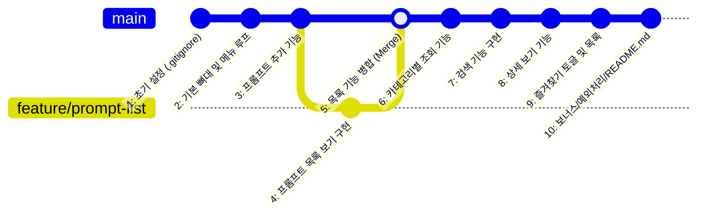

# 나만의 프롬프트 관리 프로그램 개발 계획서 (PLAN)

> **프로젝트 개요**  
> 외부 라이브러리 없이 순수 파이썬(Python 3.10+) 기본 문법만을 사용하여 프롬프트를 체계적으로 관리하는 콘솔 프로그램을 구현하고, Git/GitHub를 활용하여 기능 단위 커밋(최소 10회 이상) 및 브랜치 병합(`checkout`, `merge`) 이력을 관리하는 프로젝트입니다.

---

## 1. 요구사항 종합 분석

### 1.1 기본 필수 요구사항
* **실행 환경**: Python 3.10 이상, 콘솔(터미널) 기반 대화형 메뉴 시스템
* **라이브러리 제약**: 외부 패키지(`pip`) 설치 금지, 파이썬 표준 내장 문법 및 모듈만 사용
* **데이터 관리 방식**: 리스트(`list`) 내 딕셔너리(`dict`) 구조, 기본적으로 메모리에 보관 (실행 중 유지, 종료 시 초기화)
* **초기 데이터**: 프로그램 시작 시 최소 3개 이상의 프롬프트가 기본으로 등록되어 있어야 함
* **코드 구조**: 단일 함수 몰아넣기 금지, 기능별로 모듈화된 함수 분리 (`show_menu`, `add_prompt`, `show_list`, `search_prompt`, `show_favorites` 등)

### 1.2 보너스 요구사항 (선택)
* **보너스 1 (영속화 및 내보내기)**
  - 프롬프트 데이터를 `prompts.json` 파일로 저장 및 프로그램 시작 시 자동 불러오기
  - 전체 프롬프트를 카테고리별 Markdown(`.md`) 파일로 내보내기
* **보너스 2 (CRUD 완성 및 통계)**
  - 프롬프트 수정(Update) 및 삭제(Delete) 기능 구현
  - 상세 보기 시 조회수(`views`) 누적 카운트
  - 조회수 기준 정렬 (Top 인기 프롬프트 목록 보기)

### 1.3 Git / GitHub 요구사항
* **커밋 횟수**: 최소 10개 이상의 의미 있는 기능 단위 커밋
* **브랜치 활용**: 최소 1회 이상 브랜치 생성 및 병합 (`checkout`, `merge`) 이력 필수
  - 요구사항 명시: '프롬프트 목록 보기' 기능은 별도 브랜치에서 구현 후 `main` 브랜치로 병합
* **필수 명령어 8종 실습**: `init`, `add`, `commit`, `push`, `pull`, `checkout`, `clone`, `merge`
* **문서화**: `README.md` (소개, 실행법, 기능 목록, 카테고리 설명) 및 `.gitignore`

---

## 2. 데이터 모델 설계 (보너스 확장 고려)

추후 보너스 과제(조회수, 수정/삭제) 확장을 고려하여 데이터 구조를 사전에 유연하게 설계합니다.

```python
prompts = [
    {
        "id": 1,
        "title": "SEO 최적화 블로그 글 작성 도우미",
        "content": "당신은 10년 경력의 전문 블로거입니다. 주어진 주제에 대해...",
        "category": "텍스트 생성",
        "favorite": True,
        "views": 0,  # 보너스 과제 대비 필드
    },
    {
        "id": 2,
        "title": "제품 썸네일 고화질 이미지 생성",
        "content": "다음 제품의 매력적인 상업용 썸네일 이미지를 8k 스튜디오 조명...",
        "category": "이미지 생성",
        "favorite": False,
        "views": 0,
    },
    {
        "id": 3,
        "title": "시니어 IT 테크 리드 페르소나",
        "content": "당신은 10년 차 IT 테크 리드이자 커리어 멘토입니다...",
        "category": "페르소나",
        "favorite": True,
        "views": 0,
    },
]
```

### 지원 카테고리
1. 텍스트 생성
2. 이미지 생성
3. 영상 생성
4. 페르소나
5. 자동화
6. 기타 (또는 사용자 직접 입력)

---

## 3. 기능 및 메뉴 설계

콘솔 메뉴 구성 (보너스 과제 선택 시 메뉴 확장 가능):

```text
=== 나만의 프롬프트 관리 시스템 ===
1. 프롬프트 추가
2. 프롬프트 목록 보기
3. 카테고리별 조회
4. 프롬프트 검색
5. 프롬프트 상세 보기
6. 즐겨찾기 관리 (토글)
7. 즐겨찾기 목록 보기
-----------------------------
[보너스 기능 메뉴 - 선택 적용 시]
8. 프롬프트 수정 / 삭제
9. 인기 프롬프트 (조회수 Top 순)
10. JSON 저장 / 불러오기
11. Markdown 파일로 내보내기
-----------------------------
0. 프로그램 종료
```

---

## 4. 단계별 실행 로드맵 및 Git 커밋 전략

과제의 **10개 이상 커밋** 및 **브랜치 머지** 요건을 충족하기 위한 권장 진행 단계입니다.



### [단계 1] 환경 점검 및 Git 초기화
* Git 설정 점검 (`git config user.name / user.email`)
* 기본 브랜치명 `main` 설정
* 로컬 저장소 생성 (`git init`)
* `.gitignore` 파일 생성
* **[Commit 1]** `chore: .gitignore 생성 및 프로젝트 초기화`
* GitHub 원격 저장소 생성 후 연결 및 푸시 (`git remote add origin`, `git push -u origin main`)
* 공개 샘플 저장소 1회 `git clone` 실습

### [단계 2] 기본 뼈대 구축 및 메인 루프
* 초기 기본 데이터 3종 정의
* 메뉴 출력 함수(`show_menu`) 및 메인 실행 루프 구현 (종료 0번 처리, 잘못된 번호 예외 처리)
* **[Commit 2]** `feat: 기본 프롬프트 데이터 정의 및 콘솔 메뉴 뼈대 구현`

### [단계 3] 프롬프트 추가 기능
* `add_prompt()` 함수 구현: 제목, 내용, 카테고리 입력 및 공백 유효성 검증
* **[Commit 3]** `feat: 신규 프롬프트 추가 기능 구현`

### [단계 4] 브랜치 실습 (프롬프트 목록 보기)
* 브랜치 생성 및 전환: `git checkout -b feature/prompt-list`
* `show_list()` 함수 구현: 번호, 카테고리, 제목, 즐겨찾기(⭐) 여부 표시
* **[Commit 4]** `feat: 프롬프트 전체 목록 조회 기능 구현`
* `main` 브랜치로 전환 후 병합:
  - `git checkout main`
  - `git merge --no-ff feature/prompt-list` (병합 기록 남기기)
* **[Commit 5]** `Merge branch 'feature/prompt-list' into main`

### [단계 5] 카테고리 조회 및 검색 기능
* `filter_by_category()` 구현: 카테고리 선택 후 필터링 출력
* **[Commit 6]** `feat: 카테고리별 프롬프트 필터링 조회 기능 구현`
* `search_prompt()` 구현: 키워드로 제목/내용 대소문자 무관 검색
* **[Commit 7]** `feat: 키워드 기반 프롬프트 검색 기능 구현`

### [단계 6] 상세 보기 및 즐겨찾기 관리
* `show_detail()` 구현: 번호 선택 후 전체 내용 출력
* **[Commit 8]** `feat: 프롬프트 상세 조회 기능 구현`
* `toggle_favorite()`, `show_favorites()` 구현: 즐겨찾기 등록/해제 및 즐겨찾기 전용 목록 출력
* **[Commit 9]** `feat: 즐겨찾기 토글 및 즐겨찾기 모아보기 기능 구현`

### [단계 7] 보너스 과제 (선택 진행)
* `save_to_json()`, `load_from_json()`: 데이터 영속화
* `export_to_markdown()`: Markdown 문서로 내보내기
* `update_prompt()`, `delete_prompt()`: 수정 및 삭제
* 상세 보기 시 `views` 증가 및 인기 목록 출력
* **[Commit 10~12]** `feat: 보너스 기능 (JSON 영속화 / CRUD / Markdown 내보내기) 구현`

### [단계 8] 문서화 및 최종 마무리
* `README.md` 작성: 프로그램 소개, 실행 방법, 기능 목록, 카테고리 설명
* **[Commit (최종)]** `docs: 프로젝트 README.md 작성 및 사용 가이드 추가`
* GitHub 최종 푸시 (`git push origin main`)

---

## 5. 최종 제출물 점검 체크리스트

- [ ] GitHub 저장소 URL 준비
- [ ] 최소 10개 이상의 의미 있는 기능 단위 커밋 완료 여부 확인
- [ ] 브랜치 생성 및 머지 이력 확인 (`git log --oneline --graph`)
- [ ] 필수 Git 명령어 8종(`init`, `add`, `commit`, `push`, `pull`, `checkout`, `clone`, `merge`) 실습 완료 여부
- [ ] 제출용 스크린샷 3종 촬영
  1. 개발 환경 설정 (VSCode, Python 버전, Git 설정)
  2. 프로그램 실행 결과 (메뉴, 추가, 목록, 검색 등)
  3. `git log --oneline --graph` 결과 화면
